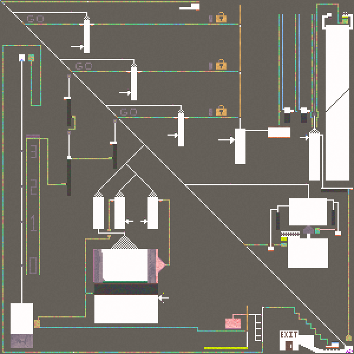

# Examples

<figure><figcaption>
A mixer for dust and seed
</figcaption></figure>

<figure><figcaption>
<a href="https://sandspiel.club/#rcDbjakVCmpz0oceeZDf">"System Complete!" by an anonymous user</a>
</figcaption></figure>

<figure><figcaption>
You don't even need preciseness to make good machines! Sometimes the most simple machines are the best.
</figcaption></figure>

